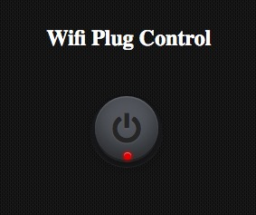
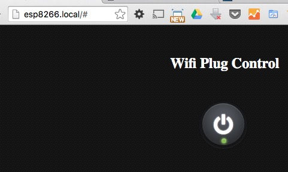

# esp8266-wifi-plug 

This Arduino language code is intended for an ESP8266 chip that controls a relay on GPIO2 and an LED(s) on GPIO0. The relay controlling if mains voltage reaches a device or not.

Once the Wifi settings are configured via the captive portal the user can connect to the 'plug' and is presented with a webpage that allows them to toggle the relay, and whatever it controls, on and off.

## Installation
The data folder contains some fonts, and is thus quite large. To use the project as is you will need an ESP8266 chip with at least 1MB flash memory. The author specified a 512k SPIFFS in the settings in the Arduino IDE.

A tool is required to upload the html and associated files to the ESP8266 from the Arduino IDE - see http://esp8266.github.io/Arduino/versions/2.0.0/doc/filesystem.html

1. Flash the code to the chip
2. Upload the data folder

## Usage

Assuming that 2 LEDS have been wired to GPIO0 (such that one is off while the other is on when the pin is set to HIGH or LOW)...

1. The two leds will flash alternately indicating that the ESP8266 is ready to be configured.
2. From a wifi enabled device, look for the Access Point created by the chip, and connect to it.
3. Try to visit any page, and you will be presented with the WifiManager configuration page.
4. After the appropriate credentials have been supplied, the ESP8266 will reboot.
5. Reconnect to your Wifi, and in a browser enter, 'http://esp8266.local' - this should present you with a CSS button that allows the user to toggle the state of GPIO2, which is connected to a relay.
6. The LED's will no longer flash. One LED will indicate the relay is off, the other that it is on.

## History

* Started as a fork of esp-arduino-boot
* Further inspired to fork ESP8266_WebSockets_NeoPixels
* Learned of WifiManager
* Full rewrite based on WifiManager with pages served from the FS
* Cool Button added from tutorial - Create A Sleek On/Off Button

## Credits

* esp-arduino-apboot - https://github.com/chriscook8/esp-arduino-apboot
* ESP8266_WebSockets_NeoPixels - https://github.com/AdySan/ESP8266_WebSockets_NeoPixels/
* WifiManager - https://github.com/tzapu/WiFiManager
* 2 LED's with One Output - http://forum.arduino.cc/index.php?topic=356038.0
* example README.md - https://gist.github.com/zenorocha/4526327
* Font Awesome - http://fortawesome.github.io/Font-Awesome/
* CSS3 Tutorial: Create A Sleek On/Off Button - http://www.hongkiat.com/blog/css3-on-off-button/
